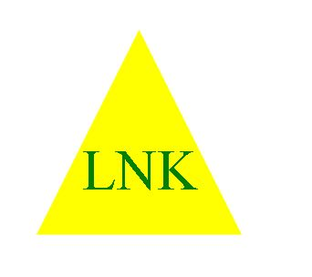

# SVG Logo Maker

## Description

This project is a simple SVG logo maker! I made this project so I could learn how to generate a simple SVG by using node.js and inquirer. I also wanted to learn how to test my code by using jest. While making this project, I focused on trying to use Object-Oriented-Programming skills, such as classes and inheritance. It was really fun to learn about making SVGs and generating my own SVGs with programming!

## Table of Contents

[Installation](##installation)
[Usage](##usage)
[License](##license)
[Contributing](##contributing)
[Tests](##tests)
[Questions](##questions)

## Installation

N/A

## Usage 

To generate your own SVG, make sure to run npm install to get the required packages, and then run node index.js to run the program. The program will ask you what shape you want, and then ask you to enter the color for your shape, the text color for your text, and then it will ask you to type up to three characters for your text. After you enter all of your answers, the program will let you know that your new SVG file has been created, and you can preview it in VS Code with the SVG extention, or you can navigate to this file in your compuer's file explorer to open it in the browser.

Here is a sample SVG logo that was created with the program:

Click [here](https://watch.screencastify.com/v/BurAxnSsATqv49JV1XBu) to watch a video walkthrough for this program.

## Contributing

N/A

## Tests

npm install jest, then run "npm test" in the terminal to run the tests.

## Questions

This is the name of my Github profile; BreePrimmer. 
Here is the link to my GitHub; [github link](https://github.com/BreePrimmer)

If you would like to reach out to me for any questions, you can communicate with me via my email, breempri@gmail.com

## Credits
I used the links that were provided in the instructions given to me for this project. I also referenced Greg's code briefly for help regarding the testing. Thank you Greg!

I didn't specifically use this video for this project, but this youtube video helped me a lot with understanding OOP. This video is from Traversy Media.

https://www.youtube.com/watch?v=vDJpGenyHaA
